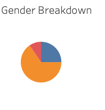
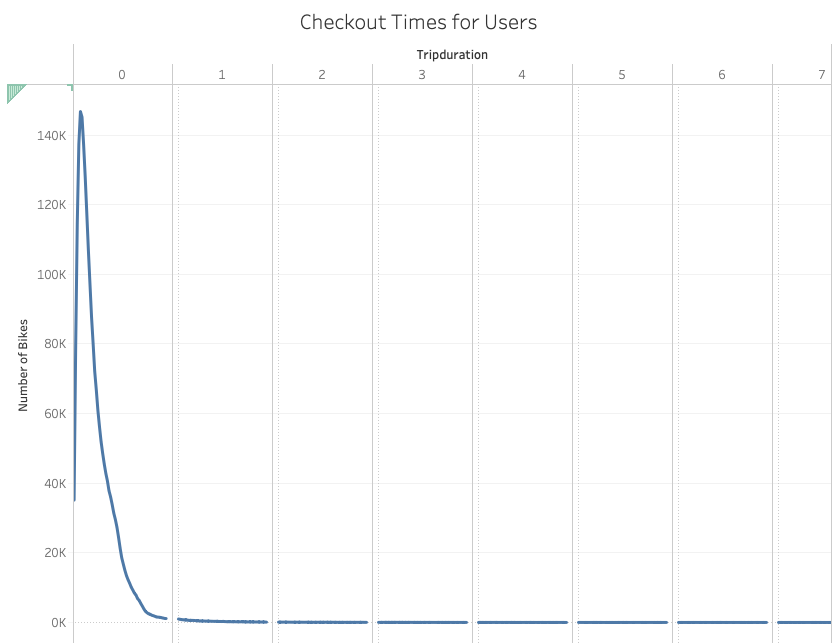

# Bikesharing

## Overview:
Bikesharing is becoming prominant in major city across the US-- why not Des Moines? As we think about the possible success of a bike-sharing program in Des Moines, it is important to look at bike sharing data in cities that have robust programs. This analysis looks at NYC bike-sharing data to help determine the success of a program in Des Moines. 

## Results:

In 2019 there were over 2.3 M bike rides using CitiBikes. 

This graph depicts the the duration of bike rides by gender.  Men use bikes at higher rates and for longer. 

This shows peak riding hours. From this, we can see peaks hours are 5pm and 6pm folloed by 8am. 

We can see here thet number of trips by weekday for each hour of the day. We see that 7am-9am & 5pm-8pm are thhe busiest on weekdays, while bike rides are more evenly spread out on the weekends. 

This visual shows the amount of men and women uses the bike. We can easily see that more than 2/3rds of the the bike rides in 2019 were by men. 

This graph depicts the the duration of bike rides. From this graph we can conclude that most people use bikes for less than an hour.

This visual shows the number of rides per weekday by gender and usertype. We can see that men with subscribtions to the bike share used the bikes the most and the most active days are thursday and friday.  

## Summary:
The results susggest that bike-sharing programs can be a well used resource. Looking at the peeak bike-sharing hours, we can conclude that people use bike-share for their communte to or from school/work. The resuts also show that man are overwhellming the main users of bike-share programs. Two additional visuzlizations that would be helpful is peak hours by gender  and the number of trips by month. 

[link to dashboard](https://public.tableau.com/views/Bikeshare_16276177316290/BikeshareStory?:language=en-US&publish=yes&:display_count=n&:origin=viz_share_link)

